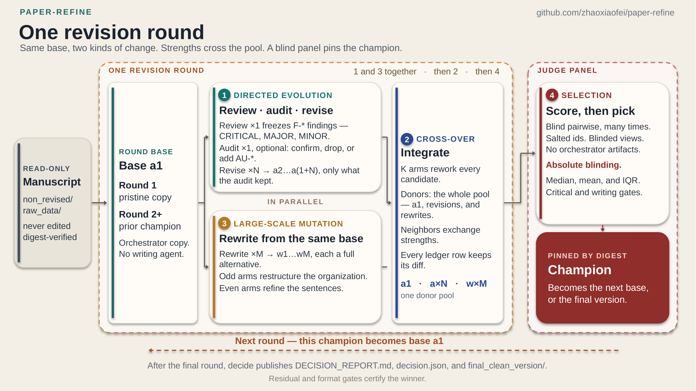

# Round-based revision pipeline (any venue or journal)

[](media/paper-refine-one-revision-round.png)

*One revision round — the read-only manuscript, the round's base `a1`, the
directed-evolution (review/audit/revise) and large-scale-mutation (rewrite) arms,
the cross-over integration, and the blind judge panel that pins the champion by
digest ([PNG](media/paper-refine-one-revision-round.png)).*

`paper_pipeline.py` drives a **round-based, content-addressed revision loop** for a
manuscript package submitted to **any venue or journal**. The submission rules
the stages enforce come from a configurable **venue profile** (`set-venue`,
`setup --venue`), and the target journal is the free-text `set-journal` value —
Nature Biotechnology is only the default profile (the behaviour of earlier
versions). Each round produces several candidate versions (rewrites, a
reviewed-and-revised version, integrations that merge the whole pool), judges
them blindly against each other, pins the champion by content digest, and feeds
that champion into the next round. `decide` publishes the final decision report
and a clean, ready-to-use package.

The repository also carries the two companion tools the pipeline uses:

* **`paper_docx_format.py`** — the code-side OOXML style/formatting scanner and
  normalizer (blank pages, running head on the title page, legend spacing,
  heading style drift, unintended italics, URL/email treatment, quotation
  marks, em-dash density).
* **`paper_redlines_adapter.py`** — the tracked-changes bridge to
  `python-redlines[docxodus]` (or `docx-trackdiff`).

## Requirements

* Python 3.9+ (the pipeline and both companion tools are standard-library only).
* An agent CLI for the stage sessions: `codex` (default), `claude`, or a custom
  command via `--agent-cmd`; `--agent manual` stages prompts for a human.
* Optional, probed at runtime and never required: the `docx` CLI (read/render/
  diff/validate), a .docx→PDF converter (the `docx-converter` MCP tool,
  `docx2pdf.sh` + Word, `docx render`, LibreOffice, `pandoc`), `pdftotext`/
  `pdftoppm`, and the `zot` CLI for read-only Zotero reference resolution.

## Quick start

```bash
# 1. create a pipeline root from the pristine submission directory
python paper_pipeline.py setup --source /path/to/non_revised --root ./paper_rounds
#    ... for another venue/journal:
python paper_pipeline.py setup --source /path/to/non_revised --root ./paper_rounds \
        --venue generic --journal "Journal Name"

# 2. run all rounds and decide (or run + decide as separate steps)
python paper_pipeline.py run-decide --root ./paper_rounds
#   python paper_pipeline.py run    --root ./paper_rounds
#   python paper_pipeline.py decide --root ./paper_rounds

# 3. inspect
#   ./paper_rounds/reports/DECISION_REPORT.md
#   ./paper_rounds/reports/decision.json
#   ./paper_rounds/round<r>_winner/          the champion of each round
#   ./paper_rounds/final_clean_version/      the champion, renamed for the next run
```

## Venues and journals

The pipeline is not tied to Nature Biotechnology. Three values, all recorded in
the root's `pipeline_config.json`, decide what it enforces and what it calls the
submission:

* the **venue** is the rule set every stage reads — the abstract/main-text
  limits and their margins, the figure-legend policy, the cover-letter
  preference, the submission-format note, and the phrases the prompts use
  ("a *X* manuscript submission", "an editor at *X*"). A venue is selected by
  **id** and realised by a **venue profile**: a JSON document under
  `venue_profiles/`, shipped with the repository or installed into the root.
* the **journal** is the publication the manuscript is going to: free text
  ("Nature Biotechnology", "Cell", "eLife"). The prompts name it, and the
  selected venue profile is checked against it. It selects no rule set by
  itself.
* the **article type** is *which* of the venue's content types this submission
  is — Article, Brief Communication, Review, Resource, Analysis, Matters
  Arising, Letter to the Editor, … — because a venue's word limits belong to the
  type, not to the venue as a whole. The profile carries the venue's table; the
  root records the selected type, and the prompts, the M19 caps and the
  decision report follow it.

```bash
python paper_pipeline.py set-venue --list                # venues this pipeline can see
python paper_pipeline.py set-venue generic               # switch the rule set (needs an existing root)
python paper_pipeline.py set-venue --journal "Cell"      # ... and the journal, atomically
python paper_pipeline.py set-venue my-journal --profile my-journal.json   # install a profile of your own
python paper_pipeline.py set-journal "Cell"              # change only the journal
python paper_pipeline.py set-article-type --list         # the venue's content types + their caps
python paper_pipeline.py set-article-type brief-communication   # select the article type
python paper_pipeline.py set-article-type --show         # current venue / type / journal / limits
python paper_pipeline.py set-venue --show                # current venue, journal, resolved limits
python paper_pipeline.py set-venue --show --json         # the same, machine-readable
python paper_pipeline.py status --root ./paper_rounds      # prints venue, journal and limits too
```

`setup --article-type <id>` selects the type at creation time, and
`set-venue --article-type <id>` does it atomically with a venue change. The
shipped `nature-biotechnology` profile carries the venue's content types but
states word limits for its **Article** type only: choosing Brief Communication
(or Review, Perspective, Analysis, Resource, Correspondence, Matters Arising)
never borrows the Article caps — the stages count the sections and name the
limit the venue's own content-types table gives. Fill a type's numbers into a
copy of the profile (see `venue_profiles/README.md`) and install it with
`set-venue <id> --profile <file>` to have the pipeline enforce them.

**Storage and precedence.** `setup` writes `venue`, `journal`, `article_type`
and a snapshot of the resolved profile (`venue_profile`) into
`<root>/pipeline_config.json` and mirrors them into `state.json`. `set-venue`,
`set-journal` and `set-article-type` update the same file. Resolution order,
highest first:

1. the flags of the command being run (`setup --venue/--journal`);
2. `<root>/pipeline_config.json` (the authoritative record for the root);
3. `<root>/venue_profiles/<id>.json`, then the profiles shipped next to the
   script, then the built-in fallback inside `paper_pipeline.py` — for a root that
   has not recorded a snapshot yet;
4. the profile's `default_journal` when no journal is recorded, and the
   profile's `default_article_type` when no article type is recorded;
5. the built-in default venue `nature-biotechnology` when no venue is recorded
   at all (the pre-venue behaviour, so an old root keeps working unchanged).

The **snapshot wins over the files**: editing a profile never silently changes
the rules of an existing root — re-run `set-venue <id>` to re-record it. The
config file wins over the `state.json` mirror, and the two are re-synchronised
by the three `set-*` commands.

The keys those commands write (abridged — `venue_profile` is the full resolved
profile):

```json
{
  "venue": "custom-clin-journal",
  "journal": "Custom Clinical Journal",
  "journal_source": "operator",
  "article_type": "research-article",
  "article_type_source": "profile-default",
  "caption_limit": 200,
  "caption_limit_source": "profile-default",
  "venue_profile": {"id": "custom-clin-journal", "label": "Custom Clinical Journal",
                    "default_article_type": "research-article",
                    "article_types": [
                      {"id": "research-article", "label": "Research Article",
                       "length_limits": {"abstract": {"base": 250, "relaxation": 1.1},
                                         "main_text": {"base": 4000, "relaxation": 1.1}}},
                      {"id": "review", "label": "Review",
                       "length_limits": {"abstract": {"base": 200, "relaxation": 1.1},
                                         "main_text": {"base": 8000, "relaxation": 1.2}}}]}
}
```

`journal_source`, `article_type_source` and `caption_limit_source` record where
each value came from: `"operator"` when you set it yourself (`setup --journal`,
`setup --article-type`, `set-journal`, `set-article-type`,
`setup --caption-limit`), and `"profile-default"`/`"unset"` when the venue
profile supplied it. `set-venue` therefore moves a profile default to the new
profile's default and keeps an operator-chosen value — the reason
`set-venue generic` can drop a journal (no default) while `set-journal` never
does, and the reason switching venue keeps your Brief Communication selection
when the new profile carries that type (and falls back to its default type,
with a note, when it does not).

**Defaults, validation, error handling.**

| situation | what happens |
|---|---|
| no `venue` recorded (a root from before this feature) | the default venue `nature-biotechnology` is used and a note says so; `set-venue <id>` makes it explicit. |
| no `journal` recorded | the venue profile's `default_journal` is used (`nature-biotechnology` → "Nature Biotechnology"); with `generic` there is none, so the prompts say "the target journal" and `setup`/`status`/the decision report print a note suggesting `set-journal`. |
| unknown venue id | `setup`/`set-venue` fail with the list of available ids; a root already recording one reports it (`status` still runs) and every command that must render a prompt refuses to start. |
| journal that does not match the venue profile's `journals`/`journal_aliases`/`journal_patterns` | warned by `set-venue`, `set-journal`, `setup` and `status`; the venue's rules still apply. `--strict-venue` turns it into an error. |
| `venue` and the recorded snapshot disagree, or config and `state.json` disagree | reported; the config file wins. |
| invalid profile file | `set-venue --profile` fails before writing anything, listing every schema error; an invalid file already in `venue_profiles/` shows as `INVALID` in `set-venue --list`. |
| venue change on a root that already has runs | refused unless `--force` (the rounds were planned, prompted and judged under the previous rule set). |
| unknown article type | `setup --article-type`/`set-article-type`/`set-venue --article-type` fail with the type ids and labels the profile carries; a root recording one reports it, and every command that must render a prompt refuses to run. |
| article type the profile states no numbers for (e.g. Brief Communication in the shipped Nature Biotechnology profile) | reported as a note; the stages count the abstract/main text and name the limit the venue's own content-types table gives — the Article caps are never borrowed. |
| article type change on a root that already has runs | refused unless `--force`, like a venue change (the recorded prompts, caps and judgments belong to the previous type). |

`--strict-venue` (accepted by every subcommand that works on a root: `setup`,
`run`, `run-decide`, `decide`, `status`, `agents`, `set-venue`, `set-journal`,
`set-article-type`, `retry`, `prune`, `redline`) makes a missing journal, a
journal/venue mismatch, a config/snapshot disagreement and an unresolvable
article type fatal instead of advisory.

**Adding a venue.** Copy `venue_profiles/example-journal.json`, replace the
numbers with the ones your venue's own guidelines state, quote the source in
`length_limits.source`/`captions.source`, list your venue's **article types**
(each with its own numbers, or with no numbers where the venue's table gives
none), and install it:

```bash
python paper_pipeline.py set-venue custom-clin-journal --profile custom-clin-journal.json \
        --article-type research-article
python paper_pipeline.py set-journal "Custom Clinical Journal"
```

Leaving a limit `null` is supported and meaningful: the stages then count the
section and require the artifact to name the limit the venue's own table states.
`venue_profiles/README.md` documents the full schema (including
`article_types`) and walks through **two complete configurations** — the shipped
nature-biotechnology profile with its content-type table and a custom journal
with per-type abstract/main-text/legend numbers — and shows what the promoted
numbers become.

Useful flags: `--venue ID`, `--journal NAME`, `--article-type ID`
(see *Venues and journals*),
`--rounds N`, `--judges N[,N…]`, `--rewrites M[,M…]`,
`--revises N[,N…]`, `--integrators MASK[,MASK…]`,
`--caption-limit N` (default: the venue profile's own),
`--jobs N`, `--agent {codex,claude,manual}`, `--agent-cmd JSON`, `--retries N`,
`--poll S` (manual mode), `--no-redline`, `run --only 1,2` (only rounds 1 and
2; see *Running only some of the steps*). Setup-time policy flags:
`--audit {off,on}` (the auditor stage), `--placeholder-lookup {off,online}`
(resolve searchable hand-off markers before the sessions run),
`--strict-artifacts [on|fix|off]` (what a boilerplate or unfilled decision table
does to an attempt: `on` fails it, `fix` first spends one scoped repair session
on it, `off` only records the report -- see *Attempt history* below);
`decide --residual-gate` refuses to certify a champion that still carries a
residual the pipeline can see.

## The auditor (`setup --audit on`): review → **audit** → revise

The review is one session that reads a whole corpus and then disposes hundreds
of code-side rows. Its two documented failure modes are (1) closing a row with a
reason that is not about that row's bar ("no journal rule", "editorial
preference only") and (2) closing MANY rows with the SAME sentence. In a real
run, 96 scan rows were closed with one identical sentence — and the sentences
the operator later flagged were inside that pile.

`--audit on` inserts one independent session between the reviewer and the
revisers. It never edits a package; its product is the decision record
(`audit/audit.json` + `audit/AUDIT.md`):

* **every frozen finding is disposed**: `confirm`, or `drop` WITH a reason and
  evidence (the verbatim text or the file:line derivation that refutes it).
  Silence about an id is a failed attempt — an undecidable finding must be
  confirmed, because dropping it would hide it from the reviser;
* it **attacks the reviewer's dispositions**: every finding-tier row the
  reviewer closed as `OK` is re-checked against its own bar, and a real defect
  becomes a new `AU-*` finding;
* the revisers consume the **audited** list (frozen − drops + `AU-*` adds) and
  the drops stay visible to the human in `audit/audit.json`, so a drop is always
  re-checkable and reversible;
* the auditor's own artifacts pass the same disposition-quality detectors as the
  reviewer's (see below).

The stage is **off by default** so that existing roots keep their plan shape and
their arms stay comparable; turn it on when you want the extra decision layer
(it costs one session per round, not per candidate).

## Arm levels, the difference ledger, and the language pass (W-11/W-12)

* **Rewrite arms carry a level.** With `--rewrites 2` the round stages one
  `structural` arm (section/paragraph order, narrative flow, headings,
  transitions — declared in `REWRITE_REPORT.md → ## ORGANIZATION MAP`) and one
  `sentence` arm (same organization, sentence-level clarity/precision/terminology
  work). The pool then holds large *and* small differences, so the integration
  stage weighs a reorganization against a prose improvement instead of a taste
  contest. `postcheck_rewrite` records the level and rejects a report that
  declares the wrong one.
* **The integration difference ledger needs an artifact per row.**
  `integrated/DIFF_LEDGER.md` rows carry `size` (small = wording, large =
  organization), `artifact` (a before/after pair under `integrated/work/diffs/`
  for a small row, the outline diff for a large row) and `finding effect`
  (`preserves F-00x` / `undoes F-00x` / `none`). The postcheck reports rows
  without an artifact, missing size classes when the pool has both levels,
  donors missing from the table, and any port that would undo a resolved
  finding.
* **No stage may introduce a NEW class of defect.** Every package-producing stage
  is re-scanned against the package it started from, per finding-tier family: a
  family the input had none of and the output now has (a new mega-paragraph, a
  new nested parenthesis, a new value+unit outside siunitx, a new abstract
  sentence past its bar) FAILS the attempt with the offending rule named; growth
  inside a family that was already present is a warning.
* **The L1–L11 language pass runs in every package-producing stage** (rewrite,
  revise, integrate), not only in the revision arm: one row per change plus one
  coverage row per step in `work/R6_language.md`, and a code-side re-scan of the
  package after each step. A missing artifact or an uncovered step is recorded
  (and fails the attempt under `--strict-artifacts`).
* **The judge scores prose against a named rubric.** The `writing` tier's rows
  cite one of twelve checks (Q1–Q12: premise, logic slip, logic jump, coherence,
  unexplained prerequisite, redundancy, non-academic wording, register, stiff
  phrasing, grammar, typography, segmentation) with a quote and the intended
  reading. The tier stays minor-only, and the rubric carries no provenance
  vocabulary, so the panel stays blind.

## Provenance, identifiers and the residual gate

Every non-judge sandbox now also receives a code-side **provenance pack**
(`work/` and, for the review, `review/artifacts/`):

| artifact | what it carries |
|---|---|
| `NUMBERS_LEDGER.md` | every numeric literal, with the `source` the CODE could PROVE from a shipped data table (a column sum/min/max or a single cell — e.g. `45,365` = the sum of `n_cells_total`). A row whose source stays empty is the session's job |
| `IDENTIFIERS.md` | every DOI / SRA-BioProject-GEO accession / repository URL+commit / ORCID, with the orchestrator's own public-API verdict (`found` / `absent` / `error` / `skipped`) |
| `PLACEHOLDER_LOOKUP.md` | the answers the pipeline already found for the `searchable` hand-off markers (`found` = the fact; `absent` = a VERIFIED NEGATIVE such as "not posted"). A marker this table answers may not ship |
| `M24_concepts.md` + `GLOSSARY.md` | two term families competing for one concept (CN vs CNV vs CNA, simulate vs emulate, rank vs score), with counts per surface form, and the term decisions to conform to |

The lookups run through a cached probe (`reports/LOOKUP_CACHE.json`, 14-day TTL):
one cheap probe per process decides whether to query at all, results are reused
across the sandboxes of a root, and `--placeholder-lookup off` records the
questions and checks nothing (useful offline).

`decide --residual-gate` turns the recorded residuals into decision problems
(exit 5): a `searchable` marker the lookup engine answered that still sits in a
delivered package, a review whose decision tables were boilerplate or unfilled,
or unsourced numbers in the abstract/legends. Without the flag the residuals are
still recorded in `decision.json` and printed — never silently dropped.

## Round model

For every round `r` the plan is `A1_r + M rewrites + 1 review + N revises +
K = 1+M+N integrations + the judge panel`:

The round is also drawn as a diagram —
[`media/paper-refine-one-revision-round.png`](media/paper-refine-one-revision-round.png)
(shown at the top of this README); the table below is the text version of its
boxes.

| stage | id(s) | what it does |
|---|---|---|
| `a1` | `r<r>_a1` | the round's base: round 1 is the pristine copy, later rounds the previous champion (no agent) |
| `rewrite` | `r<r>_w1…wM` | full alternative versions with a **declared level**: odd arms are `structural` (organization-level, reported in `## ORGANIZATION MAP`), even arms are `sentence` (same organization, prose-level). With M≥2 the round therefore carries BOTH kinds of difference for the integration stage to weigh |
| `review` | `r<r>_review` | ONE frozen identification pass (`$paper-review`) that feeds every revise session |
| `audit` | `r<r>_audit` | **optional** (`setup --audit on`): an INDEPENDENT AUDITOR between the reviewer and the revisers — it disposes every frozen finding (confirm, or drop WITH evidence), promotes the reviewer's boilerplate `OK` closures of finding-tier rows into real `AU-*` findings, and hands the AUDITED list to the revision arms |
| `revise` | `r<r>_a2…a{1+N}` | reviewed-and-revised versions that consume the frozen review (or the audited list, when the auditor ran) |
| `integrate` | `r<r>_i1…iK` | "merge from the other versions": every pool member SELECTED by the round's `--integrators` mask reworked with the WHOLE pool as donors (the default mask 0xFFFFFFFF selects all K = 1+M+N members) |
| `judge` | `judge_t…_j…` | blind pairwise panels over the round's field (the id is an opaque token: it carries no round and no arm) |

Each run keeps its sandbox under `runs/<id>/` (`base/`, `review/`, the stage's
own output directory, `PROMPT.md`, `_pipeline_done.json`). Completion is a
marker file, never "the directory is non-empty"; every published winner and pin
is verified against the digest of the corpus the judges actually scored.

### The two input areas, and the read-only `raw_data/` directory

Every corpus the pipeline handles carries two areas that are **inputs**, never
revision content:

| area | what it is | rule |
|---|---|---|
| `non_revised/` (in the root) | the pristine copy of `--source` | read-only: re-hashed at the start of every `run`/`decide`, byte-verified in every sandbox, never written (the operator's `--source` is never touched at all) |
| `raw_data/` (inside each corpus) | the raw data — figure and table sources, data tables, the analysis snapshot the author's own scripts regenerate | read-only: a package CARRIES it, and the pipeline puts the untouched original's copy back after every package-producing stage |

Both names are this repo's snake_case spellings of older ones — `non-revised/`
and `raw_figs/` — and **both spellings of each name stay resolved**: a sandbox
area is found under either spelling (`area_dir`, `pristine_dirname`,
`raw_data_dirname`) and the raw-data manifest keys are normalised, so renaming
one of the directories never reads as a modification of the corpus.

Nothing in the pipeline MOVES an existing directory: a root or a corpus set up
under the older spellings keeps them (`runs` and `pinned/` keep their recorded
manifests either way, and `ctx.pristine` resolves whichever spelling is on
disk). Only a root created by `setup` gets the canonical names. Inside a
package, the raw-data directory is materialized under its canonical name: a
corpus whose directory is still `raw_figs/` appears in the package as
`raw_data/`, with every reference to it (`\input{raw_figs/...}`,
`\includegraphics{raw_figs/...}`, build scripts) repointed — the directory's
file names and bytes are untouched. Rename an existing root by hand if you want
the new spelling there too; every check accepts either.

The raw-data rule is enforced, not merely requested:

* the version-token rule never renames anything inside it, and a token found on
  such a file name is not read as this package's naming evidence;
* after every rewrite / revise / integrate session the directory is compared,
  file by file, against the untouched original: an edited file is restored, a
  dropped one is copied back, one the original does not have is removed, and a
  directory squatting on an original file's path is left alone (the recovery
  layer refuses to delete real work and fails that attempt) — each case is named
  in a `READ-ONLY raw data:` warning and counted in the run record
  (`runs.<id>.raw_data`);
* a pinned champion or published winner that carries raw-data edits from before
  the rule existed is REPORTED (never rewritten) when `run`/`decide` start; the
  next stage materializes the original's copy, so the deviation cannot reach a
  new package. The pin/winner comparison leaves the raw-data area out of both
  sides for the same reason.

Nothing in the area is ever a scored difference: a version is not rewarded for
changing raw data and none is penalized for leaving it exactly as it is.

## Running only some of the steps

`run --only <selection>` drives only the selected part of the pipeline in that
invocation; everything else is left pending, and a round whose other stages have
not run stays incomplete until they do. Resume at any time with a later `run`,
another `--only`, or `retry --run <ID>` (which resets one run so a COMPLETED
stage can run again).

The selection items are comma-separated and combine as a **union**:

* a **round ordinal** or range — `--only 1,2` runs only the first and second
  rounds, every stage; `--only 1-3` is the same for rounds 1..3;
* a **stage name** — the stage in every round: `rewrite`, `review`, `audit`,
  `revise`, `integrate`, `judge`, plus the aliases `w`, `a`/`a2`, `i`, `merge`,
  `j` (plurals work too);
* **`ROUND:STAGE`** — one stage of one round (`2:merge`, `3:judge`;
  `.`/`/` separate as well, and `all` stands for every stage, e.g. `2:all`);
* **one agent SESSION** — the session, not its whole stage: `rewriter2` (only
  `w2`), `integrator1` (only `i1`), `reviser1` (only `a2`, the first revise arm
  — the pipeline numbers its revise arms from `a2`, because `a1` is the round's
  base copy), `reviewer` (review session A; `review_b` is session B under
  `--review-split`) and `audit`. A round-qualified `r1_w2` / `2:w2` (also
  `2:rewriter2`) restricts it to that round; a bare `w2` applies to every round
  that has it. A round-qualified arm is read as the pipeline's OWN id, so
  `r1_a2` and the printed run id `r1_a2_revise` both mean the a2 arm (`r1_reviser2`
  keeps the friendly count and means `a3`). Only that session is materialized —
  no other stage, and no judge wave, starts in that invocation. `a1` and `orig`
  cannot be selected: `a1` is the orchestrator's copy of the previous champion,
  `orig` the pristine submission, and neither is an agent session;
* **one judge SESSION** — `r1_judge_w2_j1` (round 1, version `w2`, judge 1), also
  written `1:judge_w2_j1`; `r1_judge_w2` is every judge of that version, and a
  version without a round (`w2_j1`, `i1_j2`, `orig_j1`) applies to every round
  that has it (a bare index, `judge1`/`j1`, is judge 1 of every version, and the
  exact run id `agents` prints — `judge_t497f106d_j1` — works as it stands).
  Only the listed sessions get a sandbox/session/sheet. **A judge session is a
  STEP, not the judge step**: it runs exactly those sessions and the invocation
  then STOPS — the round decision (select + pin the champion, and through the pin
  the next round) is a step of the round's DAG that the operator did not ask for,
  so no winner is selected, nothing is pinned and the next round is not entered,
  even if the sessions that ran happen to complete the panel. The round stays
  pending and the invocation exits non-zero, saying how to finish: `--only judge`
  runs the remaining panel (the sessions already done are kept) and decides, and
  a plain `run` does the same. The panel a round is judged with is always the
  CONFIGURED one (`--judges` per version), never a selected subset; a selection
  remembered on a pending round only says which sessions to start next (a bare
  `--only judge`, a round in full or a plain `run` drops it). An unknown round,
  version or judge index is refused before anything starts, with the values that
  exist.

```bash
python paper_pipeline.py run --root ./paper_rounds --only 1,2        # only rounds 1 and 2
python paper_pipeline.py run --root ./paper_rounds --only 2:review   # round 2's review only
python paper_pipeline.py run --root ./paper_rounds --only review
python paper_pipeline.py run --root ./paper_rounds --only revise
python paper_pipeline.py run --root ./paper_rounds --only merge      # = integrate
python paper_pipeline.py run --root ./paper_rounds --only judge
python paper_pipeline.py run --root ./paper_rounds --only review,revise
python paper_pipeline.py run --root ./paper_rounds --only 1,2:merge,3:judge
python paper_pipeline.py run --root ./paper_rounds --only rewriter2   # ONLY w2 (not w1)
python paper_pipeline.py run --root ./paper_rounds --only integrator1 # ONLY the i1 arm
python paper_pipeline.py run --root ./paper_rounds --only r1_w2       # round 1's w2 only
python paper_pipeline.py run --root ./paper_rounds --only w2,r2_a2    # w2 everywhere + round 2's a2
python paper_pipeline.py run --root ./paper_rounds --only r1_a2_revise   # = r1_a2 (the printed run id)
python paper_pipeline.py run --root ./paper_rounds --only r1_judge_w2_j1   # ONE judge session
python paper_pipeline.py run --root ./paper_rounds --only judge_t497f106d_j1  # the id `agents` prints
python paper_pipeline.py run --root ./paper_rounds --only r1_judge_w2_j1,r2_judge_i1_j1
```

`all` (the default) means every round and every stage. An out-of-range round
(`--only 7` in a 2-round pipeline) is refused immediately. Asking for a round
whose predecessor is not finished (round 2 consumes round 1's pinned champion)
is reported as the unmet dependency it is, and nothing is started. A plain
`run` continues whatever is still pending; `run-decide` accepts the same flag
and then decides. A session item the round's plan cannot satisfy (a typo like
`integrator9`, or an arm a round's `--integrators` mask leaves out) is refused
before anything starts, naming the sessions that round does plan.

### Listing the agent sessions before a run

`agents --root <dir>` prints the session names every round will run, without
starting anything (a dry plan: no sandbox is materialized, no agent is launched,
no document is hashed — it costs a few sha256 calls over the plan, well under a
second on any root):

```bash
python paper_pipeline.py agents --root ./paper_rounds                 # every planned session
python paper_pipeline.py agents --root ./paper_rounds --pending       # only what may still run
python paper_pipeline.py agents --root ./paper_rounds --only rewriter2    # preview a filtered run
python paper_pipeline.py agents --root ./paper_rounds --json          # machine-readable
```

Per round it lists the base copy `a1` (no agent), each `w<k>`, the review
(`review`, plus `review_b` with `--review-split`), the `audit`, each revise arm
`a<k>` and each integration arm `i<k>` the round's mask selected, then every
judge session `judge_<token>_j<k>` with the version it judges. The producing
names are exact; for round 2 and later the base candidate is the earlier round's
pin (`r1_w2`), the member the judge wave actually scores, next to the fresh `a1`
copy that the field deduplication drops. The judge id is the **salted
per-version token** (so it carries
no provenance) derived from `(round, version id)`; the judge FIELD, however, is
deduplicated by document CONTENT once every arm exists, so a pending round's
judge ids are the *candidates*: a member whose package is content-identical to
another member's is dropped before judging and its sessions never start (the
command says so). Once the round has run, the same command lists exactly the
sessions that ran — which is also how you get a judge id for `retry --run <ID>`.

Every id it prints can be fed back to `run --only` as it stands: the producing
ids (`--only r1_a2_revise`, `--only r1_w1`) and the judge ids
(`--only judge_t497f106d_j1`, or `--only judge_1` for judge 1 of every version —
the judge token is salted and carries no round, so it is resolved against this
root's plan when the command runs). The one exception is the base copy's `a1`
line, which is not an agent session, and `run --only` says so if you try it.

### Running only some judge sessions

`--judges` says HOW MANY judges each version gets; `run --only` says WHICH of
those sessions run in that invocation (see *Running only some of the steps*) —
useful to split a big panel over several invocations, or to spend the panel
one session at a time:

```bash
run --only r1_judge_w2_j1                    # one session: round 1, w2, judge 1
run --only r2_judge_i1_j1                    # round 2's first integration arm
run --only r1_judge_w2_j1,r1_judge_w2_j2     # two of w2's three judges
```

The selector is a **whitelist** (no selector = every session, the default):
`r<round>[_judge_<version>[_j<index>]]`, also accepted as `1:judge_w2_j1`. A
missing index means every judge of that version, a missing version every version
of that round, and a missing round every round that has the version (`w2_j2`,
`j1`). A version name is any judgeable id — `orig`, `a1`, `w1`…, `a2`…, or an
integration arm `i1`… — and an unknown round/version/index is refused before
anything starts, with the values that exist.

In round 2 and later the round's BASE member is the **pin of an earlier round**,
so its id is that pin (`r1_w2`), not the fresh `a1` copy of it (which the field's
content deduplication drops): `--only r2_judge_r1_w2_j1` is the session that
judges the base of round 2, exactly as `agents` prints it. Asking for a judge
session of a round whose own arms have not run yet is refused with the list of
what is still missing, and nothing is started.

The same session may be spelled with the version id alone plus the judge suffix
(`r1_w2_j1`, `r2_i1_j2`, `w2_j2`) — the round-qualified form keeps its round
even when the rounds have different `--judges` counts — and the friendly
class+index spellings work here too (`r1_rewriter2_j1`, `r2_integrator1_j2`).
`agents --root <dir> --only <selector>` shows the ids before anything starts.

Only the selected sessions get a sandbox, a session and a sheet, and each
session's panel expectation is the **configured** one
(`expected = J(version)*(|field|-1) + Σ J(other versions)`, `J` = `--judges`):
a session selection never redefines the panel, so a partially-run panel is
simply incomplete and cannot decide the round.

**A judge-session `--only` therefore stops before the round decision.** With
`--only review,audit,revise,rewrite,merge,judge_<id>_j1` the producing stages and
exactly that one judge session run, and then the invocation ends: the round stays
pending, nothing is pinned, round 2 is not entered and the exit code is non-zero,
with the message

```
[run] r1 --only …: the selected judge session(s) ran, but the ROUND DECISION is NOT started --
this selection does not ask for the judge STEP, so no winner is selected, nothing is pinned and
round 2 is not entered.
[run] r1: finish the judge step when you want the round decided: `run --only judge` runs the
remaining panel (the sessions already done are kept) and pins the champion, or use a plain `run`.
```

Asking for the judge STEP — `--only judge` (`2:judge` for one round), a bare
round (`--only 1`), `all`, or no `--only` at all — is what selects the decision
too: the remaining sessions of the configured panel are run (those already done
are kept, not re-judged), and the round is decided and pinned once that panel is
complete. The same rule applies to every step: `--only` runs what you asked for
and never continues into a step you did not.

Re-running a selection whose rounds are already complete is a **successful
no-op** (exit 0): `run --only 1:judge` after round 1 was decided prints
`round(s) 1 of 2 are already complete -- nothing to do in this invocation` and the
usual "ran round(s) 1 of 2 … Next: run …" tail. Only a selection that COVERS a
round which still needs work but could not start anything in it (a roundless
`--only w2` on a root where no pending round has `w2`) is an incomplete
invocation: it says `selected no session of the round(s) that still need work (…)`
and exits non-zero.

## Per-round judges and integrators

Both are per-round command-line parameters with the same list rules as
`--rewrites`/`--revises` (one integer applies to every round; a shorter list is
extended by repeating its last element; a longer one is truncated):

* `setup --judges 3,1` runs **3 judge sessions per version in round 1 and 1 in
  round 2**. Each round's panel is complete only when every field member
  carries its own round's `2*judges*(|field|-1)` directed scores, and the
  decision report prints the per-round counts. Bump the final round when the
  earlier rounds are for triage, or lower it to make a long run affordable.
* `setup --integrators 0x5,0xFFFFFFFF` is a **32-bit mask per round** selecting
  which agents run an integration session. Bit `k-1` belongs to the k-th member
  of the round's pool `[a1, w1..wM, a2..a{1+N}]`, so in a round with M=2, N=1
  (`pool = a1, w1, w2, a2`): `0x5` = bits 0 and 2 = only `i1` (a1 reworked) and
  `i3` (w2 reworked) run; `0x0` runs no integration at all and the round's
  field is the pool alone; the default `0xFFFFFFFF` means **every applicable
  agent** (bits beyond the pool size are ignored, so the default keeps selecting
  the whole pool whatever M and N are). A skipped arm costs no session, is never
  judged and can never win — the round's recorded plan, the run log and
  `DECISION_REPORT.md` all name the arms the mask left out.

Masks accept decimal (`5`), hex (`0x5`, the documented default form) and the
other Python integer-literal forms. A pool wider than 32 members cannot be
addressed by the mask and is refused at setup. Like `--rewrites`/`--revises`,
all four are `setup` parameters recorded in `pipeline_config.json` (and mirrored
into `state.json`); edit the file to change a not-yet-finished round's plan, and
note that a round already decided keeps the plan it was decided with.

## Style/formatting checks and repairs

The corpus converters read DOCX **text only**, so layout and character
formatting used to be invisible to every stage. The pipeline now handles it:

* `setup` scans the source (`state.original_format`, printed as
  `[setup] OOXML formatting scan:`), copies `paper_docx_format.py` into the root,
  and — unless `--format-fix off` is given — **normalizes the pristine copy**
  before anything is fingerprinted (text identity verified by the fixer; the
  operator's `--source` directory is never modified).
* every package-producing stage (`rewrite`/`revise`/`integrate`) normalizes its
  candidate in the postcheck, i.e. **before** the corpus digest, the pins, the
  judge views and the next round's base are built. The repair is reported as a
  `FORMAT-FIX: …` warning and recorded in
  `runs/<id>/FORMAT_FIX_<run>.json` (with before/after scans).
* the review stage receives a seeded `review/work/FORMAT_SCAN.json` plus
  `review/artifacts/M20_formatting.md` (one row per finding to dispose) and the
  review contract requires an `M20` coverage row, like M18/M19.
* `decide` re-scans the winner, reports it in `decision.json` /
  `DECISION_REPORT.md`, and `publish_final_clean` normalizes + verifies the
  published `final_clean_version/` copy.
* `decide --format-gate` promotes HIGH-severity findings (break-only
  paragraph/blank page, tracked changes, unreadable package) to decision
  problems (exit 5). The scan stays advisory without the flag.

Policy overrides (`setup --format-policy policy.json`): `journal_italics`,
`quote_style`, `caption_line`, `caption_space`, `title_page_header`,
`url_style`, `max_em_dashes_per_1000`, `unlink_zotero_fields`,
`align_heading_sizes`, `blank_page_tolerance`.

Stand-alone use (never edits in place unless you pass `--out` yourself):

```bash
python paper_docx_format.py scan  <dir> --pdf <rendered.pdf> --json out.json
python paper_docx_format.py fix   file.docx --out file.fixed.docx
python paper_docx_format.py check-pdf rendered.pdf
```

Findings inside Zotero fields (the bibliography, citation fields) are reported
`field-protected`: Word cannot restyle a field result persistently. Fix the CSL
style, or set `"unlink_zotero_fields": true` in the policy for a submission copy
where the reference list becomes plain text.

### Journal / emphasis consistency (M20, rules FMT-T6c–T6g)

Character formatting that lives in a **style** used to be invisible: the scanner
read only a run's own `<w:i/>`, so a journal name italicised through Word's
`Emphasis` *character style* looked identical to roman text. On a real cover
letter that produced `Nature Biotechnology` italic in two sentences and roman in
the others, and `Nature Methods and other leading journals` emphasised as one
unit. The scanner now resolves the full precedence — direct run properties >
character style > paragraph style > document defaults (`w:i` and `w:iCs`,
including explicit `val="0"` off-switches) — and adds four rules on top of the
existing italic checks:

| rule | finding | fix (policy `journal_italics`) |
|---|---|---|
| `FMT-T6c` | a journal name is italic outside the reference list (`refs-only`/`off`) | pins the run roman with a direct `w:i val="0"` override that beats the character style |
| `FMT-T6f` | an emphasis span continues past the journal title onto ordinary lowercase prose (`… and other leading journals`) | pins the continuation runs roman |
| `FMT-T6e` | the same journal name is italic in one place and roman in another (reported per region: body text vs reference list) | the per-run rules above/below resolve it; the row itself is a report |
| `FMT-T6g` | a reference-list journal title is left roman (`refs-only`/`everywhere`; or in body text under `everywhere`) | makes the title run italic, but only when the run IS the title (a run that also carries volume/pages is reported, never re-styled) |

Guard rails: journal-like words inside ordinary prose, hyphenated compounds and
URLs (`Cell-line`, `(Single-Cell)`, `github.com/…/Single-Cell-…`) are not
journal titles; a title keeps its capitals (`Cell Syst.`, `Cell Rep. Methods`),
prose is lowercase, so the run-on rule never eats an abbreviated title; and a
legitimate italic in body text (`de novo`) is left alone. Runs inside Zotero
fields stay `field-protected` unless `unlink_zotero_fields` is set.

Every scan also carries a **font/paragraph-style inventory** (`style_survey` in
the JSON: fonts and sizes in use, paragraph styles, character styles, and how
many runs are italic via direct formatting vs a character style vs the paragraph
style). It rides along in `FORMAT_SCAN.json`, `CODE_SCANS.json` and the M20
artifact, so a visually observed font/style oddity can be traced to the OOXML
that produced it.

Verification of a repair is code-side and visual: the fixer re-scans the output
(all mechanical rules must be gone), asserts the document TEXT is unchanged and
every other package part is byte-identical, runs `docx validate` when available,
and the rendered page pass (`check-pdf`, the agents' `VIS_visual` record) covers
what OOXML inspection cannot see.

### Text-level consistency across the whole package (rules FMT-T8a–T8e and FMT-T9c/T9f/T9g/T9i/T9j)

Some consistency problems are not OOXML at all — they are in the text — and they
now run over every `.docx` AND every `.tex/.ltx/.md/.txt` source, so a problem is
found in the cover letter, the main text and the supplementary alike:

| rule | finding | action |
|---|---|---|
| `FMT-T9c` | long sentence or long list-paragraph, **section-tiered**: 40 words in a cover letter/abstract/legend, 46 in the body, 61 in Methods; `>=3` enumerated items inside a `>200`-word paragraph | finding (finding-tier); the reviewer must dispose it against that bar |
| `FMT-T9f` | a term the manuscript glosses in place ("X (Y, which …)": `average spot length (sequencing read length, …)`) | finding: use the standard term, or keep the gloss as a recorded decision |
| `FMT-T9g` | a LaTeX value+unit outside siunitx (`\qty{}{}` / `\SI{}{}`, `\num{}` for bare numbers; both spellings accepted) | finding; `\code{}`, verbatim, URLs, `\cite`, cross-references, inline math and generated tables are exempt |
| `FMT-T9i` | a mega-paragraph (`>250` words, non-Methods) | finding: split it at the natural boundary |
| `FMT-T9j` | two term families competing for one concept (CN/CNV/CNA, simulate/emulate) | finding: fix one term per concept in `GLOSSARY.md` |
| `FMT-T8a` | a document mixes citation formats (`(Author et al., 2015, Nature Methods)` vs `(Author et al., Nature Methods, 2015)` vs `(Author et al., 2015)`) | report; with `citation_journal_names="drop"` (default) the redundant journal segment is deleted, leaving one author-year format. Reported only when an odd form cannot be matched safely |
| `FMT-T8b` | nested parentheses (`(… (BAF))`) | finding-tier — moving the inner item out is a wording decision the revision stage makes; mathematical calls like `T(·,·)` are excluded |
| `FMT-T8c` | a distinctive term repeated in one short passage (`Nature Biotechnology` five times in a cover letter) | finding-tier redundancy: a proper name ≥3× in one paragraph, or a long content word ≥5×, must be varied or dropped — a writing-quality defect does not need a journal rule to exist. Deliberately narrow: proper names (2–3 capitalized words, no document-structure word) and single long content words |
| `FMT-T8d` | US/UK spelling variants in body text (`tumour` … `tumor`) | report; `term_spelling="dominant"` (default) normalizes the minority form outside the reference list |
| `FMT-T8e` | an attributive compound hyphenated in one place and not in another (`copy-number profiles` … `copy number estimate`) | report; `term_hyphenation="dominant"` (default) hyphenates the minority attributive form |

Guard rails: the reference list is never rewritten (its titles are quotations),
URLs/DOIs/e-mails are masked, `Table S1` inside `Supplementary Table S1` is not a
variant, and the citation/spelling/hyphenation fixes record every text edit —
the fixer's verification then proves that NOTHING beyond those recorded edits
changed (`verified.text_diff_only_recorded_edits`).

### Deliverable validation (DOCX XML + LaTeX), by the agents and by the pipeline

An invalid file is not a deliverable, so every EDITING session (rewrite, revise,
integrate) has to validate what it produced:

```bash
python paper_docx_format.py validate <package dir>   # module sits next to PROMPT.md
```

It checks every `.docx` (readable zip, EVERY XML/`.rels` part parses, `docx
validate` schema check when the CLI is installed) and compiles every STANDALONE
`.tex` (`\documentclass`) in a scratch copy — `\input` fragments are validated
through the document that inputs them, and a missing TeX engine is reported as
SKIP, never as a failure. The prompt tells the agent to iterate at most three
times and, if it still fails, to leave the package as it is and record the exact
file, command and engine error in the manual-steps list.

The orchestrator does not trust that loop: the stage postchecks run the same
validator on the produced package and record the result on the run
(`rec["validation"]`). A malformed `.docx` fails the attempt, and a LaTeX
document that no longer compiles fails it too — but only when the package the
stage started from DID compile, so an author's pre-existing LaTeX breakage is
reported, never punished. A failed attempt goes through the normal retry policy
(`--retries`), which is the hard cap on the loop. The public, stateless module is
copied next to `PROMPT.md` in every session sandbox (including the judge's, whose
prompt names the same command); it carries no per-run data, and the judge's copy
is stamped with the view timestamp.

## The code-side evidence pack (identical numbers in every session)

Every session is seeded with the orchestrator's own measurements of its corpus,
so the review, the rewritten/revised/integrated packages and the judge panel
cannot disagree about a number:

| artifact | what it holds |
|---|---|
| `CODE_SCANS.json` | M18 legend counts, M19 abstract/main-text lengths, M20 OOXML formatting rows, the hand-off placeholder count and the corpus identity (digest, file list, revision token) |
| `EVIDENCE_PACK.md` | the same, human-readable, with the re-scan command |
| `M18_caption_words.md`, `M19_length.md`, `M20_formatting.md` | seeded tables (one row per code-side finding, empty disposition column) for the review and the judge |
| `CODE_SCANS_before.json` / `CODE_SCANS_after.json` | per stage: the input's and the delivered package's measurements, with an `evidence_delta` (over-cap sections, placeholders, formatting rows) recorded on the run and warned about when it regresses |

Where it lands: `review/work/` + `review/artifacts/` (review) and `work/` at the
sandbox root (rewrite/revise/integrate, scanned from the package the stage is
about to edit). An `EVIDENCE_PACK.md` also sits next to `PROMPT.md` and inside
the session's OUT directory. Those four prompts carry the same block: use these
numbers instead of re-estimating, dispose or reconcile every seeded row in your
own artifact, and state before → after numbers whenever your work changes one of
them.

**The judge gets none of it — blinding is absolute.** A judge sandbox contains
only the blinded views (`target/`, `field/<label>/`, `original/`) and the prompt;
no review findings, no change ledger, no orchestrator scan, no digest or
revision token, no pre-computed M18/M19/M20 rows. Even a scan computed from the
judge's *own* target would be a pre-digested view (and a digest it could
correlate), so the judge prompt instead carries a BLINDING RULE: derive every
measurement yourself from the packages in front of you with the same public
tool (`python paper_docx_format.py scan target/`) and record the rows in
`judge_review/artifacts/`. Consistency is then checked from the orchestrator's
side: after a judge run, `postcheck_judge` re-scans that blinded target itself,
records it in `reports/judge_evidence_<run>.json` and the run record, and warns
(never fails) when the judge produced no corresponding artifact table. The
panel's numbers stay auditable without the judge ever being handed an answer
key.

What a judge can see is submission content only, and every other channel is
closed by construction:

| channel | what a judge view does |
|---|---|
| file names / labels | every view is a salted per-view permutation of `d01/`, `f0001<ext>` placeholders, so the same document has a different name in `target/`, in each `field/<label>/` and in `original/`; the label → version map lives only in the run record |
| run ids | `judge_<token>_j<k>` is an opaque token derived from (round, target, salt): no round prefix, no arm name, not recomputable without the root secret |
| timestamps / modes | one mtime and one mode for the whole session, identical across all its views (nothing to order the packages by) |
| auxiliary files | revision auxiliaries (`*.tracked.docx`, `*.before-after.docx`), the pipeline's bookkeeping/report files (`CHANGELOG.md`, `MANUAL_STEPS.md`, `REVISION_REPORT.md`, `revision_report.json`, `DIFF_LEDGER.md`, `VISUAL_CHECK.md`), the `work/` scratch and Word's `~$name.docx` owner file never reach a view |
| derived outputs | a judge is handed the SOURCES, never what can be compiled from them: the build by-products of an editable source (`.aux`, `.log`, `.toc`, `.synctex.gz`, …) are dropped -- a build log names the machine, its absolute paths and the exact build date, and a package an agent went over loses them while the untouched original keeps them, so their mere PRESENCE would say which package was worked on -- and so is any other derived file whose editable source ships beside it: a compiled `.bbl` next to its `.bib`, a rendered PDF next to its `.docx`/`.doc`/`.tex`/`.ltx` (same stem, version tokens ignored). The judge can compile or render the source itself. A derived file with NO source in the package stays, because it is then the only copy of the content: with no `.bib` shipped, a `.bbl` is the reference list |
| Word/PDF metadata | OOXML views are canonicalized (sorted entries, one fixed zip timestamp, core/app/custom properties blanked, `rsid`/`paraId`/`textId`/proofing/last-rendered-page markers and tracked-change author+date attributes stripped, tracked changes accepted, `docProps/thumbnail*` dropped, Word's cached Pages/Words/Characters zeroed); a PDF's `/Info`, `/ID` and uncompressed XMP identifying values are blanked in place |
| prompt / session | the judge prompt carries no round, arm, stage or provenance vocabulary (`round`, `arm`, `revise`, `integration`, `champion`, … all absent -- asserted by `test_judge_blinding.py`), no bookkeeping file name, and no hand-off marker token; the placeholder rule is stated in provenance-neutral wording |

Known limit: there is no OS-level jail, so a judge that ignores its prompt could
walk up out of its sandbox into the pipeline root. The prompt states the
restriction explicitly ("siblings and parent directories are off-limits … do
not go looking") and the orchestrator never rewards it: the panel's evidence is
re-derived from the blinded target outside the sandbox (`postcheck_judge`).

One consequence worth knowing: because a judge sees the sources, a *stale*
submitted PDF (a rendering that no longer matches the editable file beside it)
is no longer a judge finding -- the review/revise/integrate stages still see
every rendering and still flag it, and the shared derived-output rule below
still applies to them.

## One defect vocabulary, one artifact process

Every session classifies a defect the same way, so an improvement one session
sees is an improvement the panel can score. The block is generated from
`BASIS_TIERS` and inserted verbatim into all five prompts (review, rewrite,
revise, integrate, judge); the same table lives in the review skill
(`paper-skills/paper-review/references/sweeps.md`, mirrored in
`paper-skills/prompts/identify_issues.prompt.md`) and in the revision ledger's
definition (`paper-skills/paper-revise/references/ledger.md`):

| review category | scored class (`correctness > consistency > preservation > completeness > formatting`) |
|---|---|
| 0 Editor/Reviewer concerns | `correctness` (unsupported claim, overclaim, rigor, ethics), `completeness` (required information missing) or `preservation` (removed content/limitation) |
| 1 Completeness & Factual Integrity | `correctness` (factual error, wrong number/DOI/reference key, broken cross-reference) or `completeness` (mandatory item missing) |
| 2 Writing Quality, Logic, Repetition | `consistency` (the same thing said/spelled/numbered two ways; a convention applied unevenly), `correctness` (the wording changes the meaning) or `formatting` (a one-off wording preference) |
| 3 Plagiarism / AI content | `correctness` (integrity of the content itself) |
| 4 Technical Formatting | `formatting` (M18/M19/M20; ≤ ±1 and never decisive alone) |
| 5 Missing / Unneeded Information | `completeness` |

Severity is shared too (CRITICAL / MAJOR / MINOR), and an improvement claim must
name the class and the concrete item behind it -- a difference that cannot be
named in this vocabulary is cosmetic and scores 0. What differs between sessions
is the *deliverable*, not the vocabulary: an identification session reports
findings and never scores, a comparison session scores one target against one
opponent and never ranks, and a package-producing session resolves findings in
its own copy and keeps one ledger row per finding.

**The judge's integer is derived from its own ledger, and the rules that derive it
are consistent by construction** (fixed 2026-09-23). Each row weighs minor 1 /
major 2 / critical 3, the per-tier nets are capped (correctness ±4,
consistency/preservation ±3, completeness ±2, formatting/writing ±1), and the
capped sum is then bounded by the rung the rows can BACK: MINOR rows reach ±2 at
most, |3| ("clearly better/worse") needs a MAJOR row outside formatting/writing,
|4| ("decisive") needs a CRITICAL one. Before that bound existed the caps alone
could DEMAND a number the rung check then forbade (three minor consistency rows
summed to 3 with no MAJOR row; two MAJOR correctness rows summed to 4 with no
CRITICAL row), so no sheet could satisfy both and real panel sessions failed
whichever number they wrote. Two spellings/placements are tolerated for the same
reason: a sweep RULE id in a row's `check` is read as the check that owns it
(`FMT-*` → M20, e.g. `FMT-T9c`), and the judge's own `judge_review/work/` scratch
(normalized copies, renders, sweeps) is never validated as a deliverable -- a
truncated intermediate `.docx` there says nothing about the panel.

The artifact *process* is shared as well; the differences are deliberate:

| artifacts | sessions | why this shape |
|---|---|---|
| `inventory.md` + `artifacts/M<id>_*.md` (ENUMERATE → ARTIFACT → AUDIT) + the M18/M19/M20 tables | review, judge | the judge runs the same frozen sweep set as the review; it must derive its own rows from the blinded packages |
| `work/CODE_SCANS.json` + `EVIDENCE_PACK.md` (the orchestrator's own M18/M19/M20/placeholder counts and corpus identity, from one set of functions) | review, rewrite, revise, integrate | one measurement of one corpus, so no session re-estimates a number; the scans use the same file-set rules as the pin and the judge view (`work/` scratch, auxiliaries, bookkeeping and derived outputs never counted) |
| nothing seeded at all; `postcheck_judge` re-scans the blinded target outside the sandbox | judge | a pre-computed row would be an answer key |
| `CHANGELOG.md` + `MANUAL_STEPS.md` inside the package | rewrite, revise, integrate | the package's own record of what changed and what the author must still do |
| `REVISION_REPORT.md` + `revision_report.json` (one row per frozen finding id) | revise, integrate | only these sessions are given findings to resolve |
| `scores.json` (signed comparison items with class + severity) | judge | only the panel scores |

**How a round is decided (one ranking key, every arm on the same terms):**
`-median`, `-mean` (breaks a median tie on the same flat directed-score list),
`IQR`, `critical_remaining`, `writing_remaining`, then the provenance-free
content digest and only after that the run id. `critical_remaining` and
`writing_remaining` are counts the *package-producing* session reports in its
completion marker -- CRITICAL-severity findings still open, and the frozen
review's category-2 (writing quality / logic / repetition) findings still open
-- so severity outranks style, and style can only separate versions the panel
statistics cannot. Both are cross-checked against the frozen review (the
revision arm is warned when it claims zero while the review lists such
findings), both are +inf when absent (absence never wins a tie), they are never
a score, a gate or a reason to make a version ineligible -- and the judge is
never asked for either number (blinding). An exact tie on `median`, `mean` and
`IQR` still keeps the incumbent base: a better writing count separates
challengers, it does not retire an incumbent the panel cannot distinguish from
them. `manual_steps`, caption lengths and hand-off placeholders are reported in
`DECISION_REPORT.md` / `decision.json` (the table has `critical` and `writing`
columns) but never ranked on.

The numbers behind that table are inspectable per round: `run` writes
`reports/round<r>_raw_scores.csv` as soon as the round is aggregated (decided or
not -- an incomplete panel's scores are just as readable), and `decide` refreshes
it and back-fills any decided round from a root that predates the file. It holds
ONE row per directed score: `credited` is the flat list the member's `median` and
`mean` are computed from (`direction = own` is the member's own judge session's
integer; `direction = received` is another member's session scoring THAT member
against this one, stored negated), with the sheet it came from
(`source_judge_run`, `source_judge_index`, `sheet_target`, `opponent_id`,
`score_as_written`, `basis`, `resolved`, `introduced`) and the recorded
`member_n`/`member_median`/`member_mean` repeated on every row -- so "why do the
median and the mean disagree?" is answered from the file alone.

## Attempt history: every attempt is kept, not just the last one

A run can be attempted several times (`--retries`, a fresh invocation, a
`retry`). Before this layer existed, the run record's `postcheck`/`last_error`
described only the FINAL attempt — the 2026-09-22 root showed a review failing on
the M1b gate while attempt 1's three real problems survived nowhere except the
text of attempt 2's prompt, and attempt 1's artifacts had already been destroyed
by the retry.

Now every attempt is recorded and its evidence is preserved:

| where | what it holds |
|---|---|
| `state.json` → `runs.<id>.attempts_log` | one entry per attempt: number, source (`postcheck` / `process` / `adopted` / `recheck` / `re-verify` / `manual`), timestamps, duration, status, the postcheck's errors and warnings, the decision-artifact quality report, the marker's own summary, and the paths of the attempt's archive and transcript (capped at 25 attempts per run, 60 messages each, 4 KB per message) |
| `runs/<run>_try<N>_failed/` | the FAILED TRY's whole sandbox, renamed there before the retry builds a fresh `runs/<run>/`: the deliverables exactly as the postcheck judged them, the corpus copies, the agent transcript and a self-describing `record.json` (which names the attempts whose work it holds — a stage attempt and, when the scoped repair ran in it, the repair session too). `prune` reclaims these with the round they belong to |
| `runs/_logs/<run>.<attempt…>.log` | transcripts of attempts whose sandbox was reset by a `retry` or a revalidation (a sandbox kept as `_try<N>_failed` keeps its own `_agent.log` inside) |

The console prints **all** of an attempt's problems (one per line, not a single
140-character cut) and the same complete list is handed to the NEXT attempt: the
retry prompt's `=== PREVIOUS ATTEMPT FAILED ===` block now names every error (no
four-message, 1200-character cut), the attempt's warnings, and where its kept
sandbox is — so one retry can fix all of them instead of rediscovering them one
per session. `status` and `DECISION_REPORT.md` list every failed attempt with its
first problem and the paths above, and `prune` reclaims the kept sandboxes of the
rounds it prunes — the attempt RECORDS stay in `state.json`, so the history
remains readable and says that the kept sandbox is gone.

A defect message is part of this record: a repeated disposition is now quoted in
full and names the rows it is about (`-- rows: <document> / <heading> / para n`),
so an operator (or a repair session) can act on it without opening the artifact.

**Which pipeline created the root is recorded.** `setup` prints and stores the
running script's path, version and SHA-256 (`state.json` → `pipeline`), and every
later invocation says so when the script it is executing is NOT that copy
(patched, replaced, or a different checkout). The 2026-09-22 roots needed this:
`setup` had been run from a stale checkout, so the root silently contained a
pipeline without the scoped-repair code and hours were spent asking why
`--strict-artifacts fix` never fired.

**An adopted run is repaired too.** When a resume finds a run whose sandbox
already carries its completion marker (`sweep_artifacts`), the same postcheck runs
— and if it fails on repairable bookkeeping, the scoped repair session runs right
there, so a finished 45-minute review is not thrown away for two unfilled tables.

### A STOPPED session is continued, not restarted

A session can end before its deliverables exist — a model that stops mid-turn, a
CLI timeout, a killed process. The 2026-09-22 root lost an integration arm twice
that way (366k / 204k tokens, `task_complete` with no final message, nothing
written), and a fresh attempt would have re-read four corpora to redo work the
session had already done. The CLI keeps such sessions, so the pipeline CONTINUES
one instead:

* the id the CLI prints in its banner (`session id: <uuid>`) is already in the
  attempt's `_agent.log`, so no extra channel is needed; it is captured into
  `runs.<id>.agent_session_id` and shown in the attempt history;
* an attempt that looks **unfinished** — a process-level failure (timeout/kill),
  or a postcheck error naming a deliverable that does not EXIST — is continued:
  `codex exec resume <session-id> <same overrides> -` (or, for the `claude`
  preset, `… --print --resume <session-id>`, falling back to `--continue`, which
  resumes the most recent session of that sandbox's own directory). A custom
  `--agent-cmd` has no known resume form and gets a fresh attempt as before; an
  attempt that *finished* and was rejected on content is not continued either —
  that is the retry/repair path's business;
* the continuation prompt names what stopped and what the postcheck said, and
  tells the session to finish from where it is, marker last. A continuation that
  clears the postcheck is recorded as the attempt that finished the stage
  (`source: "continuation"`); one that does not is a failed attempt like any
  other and the retry policy takes over;
* the budget is **at most 2 continuations per session id** (`resume_attempts`),
  counted across attempts, and the console says so when it is spent (`no
  continuation -- 2 continuation(s) already spent on this session (limit 2)`).
  `RESUME_PROMPT.md` is written into the sandbox for the session and removed
  afterwards; the continuation never replaces the scoped artifact repair, it runs
  before it.

### `--strict-artifacts fix`: one scoped repair session instead of a full re-run

Some failures are BOOKKEEPING: the stage did the work, but the report/ledger/
sheet the postcheck reads is unfilled, inconsistent or unfinished. Re-running
such a stage costs its whole session again and re-samples everything it produced
(the 2026-09-22 root got a different 102-finding review out of a retry that was
only fixing a disposition column). `--strict-artifacts fix` (alias
`--fix-artifacts`) spends ONE bounded session on the failed attempt's own sandbox
first. Every stage has a PROFILE — which problems are repairable bookkeeping,
which files may change, and which evidence is pinned:

| stage | repairable (examples) | may write | pinned evidence |
|---|---|---|---|
| `review` | the decision-artifact quality problems (empty cells, boilerplate closures, echoed OUTLINE summaries), the M1b long-form gate (undisposed residue rows — the class that failed the 2026-09-22 roots), a missing visual record | `review/artifacts/` (the seeded tables **including `M1_acronyms.md`**), `review/work/` | every table's row identity, all headers and column orders; `findings.json`/`md`, `round2/`, the other artifact files |
| `audit` | `audit.json` missing/unparseable/duplicated/missing dispositions | `audit/` | every existing disposition and every `adds` row; **new dispositions must be `confirm`** (a drop hides a finding from the revisers and needs the auditor's own evidence) |
| `rewrite` / `revise` / `integrate` | an EMPTY/thin report or ledger the stage wrote (`REWRITE_REPORT.md`, `revision_report.json`, `DIFF_LEDGER.md`: blank cells, wrong level, missing `artifact` rows), the language-pass coverage rows, the visual record, the marker | the package's bookkeeping files the stage wrote (by name) and its existing `work/` files | every manuscript file of the package; the frozen review; the corpus inputs |
| `judge` | a missing `checks` coverage map, `score`/`basis` that contradict the sheet's own ledger, bookkeeping ids, a missing grounding record | `scores.json`, `judge_review/` | `resolved`/`introduced` (the ledger IS the judgement), the comparison set, existing coverage entries; new coverage entries must be `unable` |

**Variant B — a repair finishes the paperwork of work that happened, it never
substitutes for the work.** A repair may only CHANGE files the stage itself
wrote: it completes them (fills cells, finishes the rows, corrects the marker's
ids). A deliverable the stage never wrote — a missing ledger, report, language
pass, visual record or completion marker — is **not repairable**: that attempt
fails, the run stays incomplete, and the stage is re-run (or its stopped session
resumed). The gate refuses such a repair before spending the session, the prompt
says so, and the guard enforces it mechanically (a file created anywhere inside
the repair's writable scope is out of scope, `/tmp` is the repair's scratch).
This is deliberate: the alternative was a repair that manufactured a "completed"
stage out of nothing — the 2026-09-22 `r1_i3` run read that way, where a stalled
session's paperwork was completed while the package stayed byte-identical to its
base (the sessions that ran to completion changed 8/8/5 documents).

A repair may **fill, never re-judge**: it must write
`unable — manual verification required: <what the author must check>` where the
sandbox's own evidence is not enough, and it may never touch a submission
document, a citation, a number or another stage's deliverable. The orchestrator
verifies the scope byte-for-byte (plus the per-stage structural rules above) and
then re-runs the **identical postcheck**; anything else — a missing deliverable, a
validation failure, the M1b vanishing-residue gate, residuals, the pristine copy —
stays a plain failure. A repair that clears nothing, or that went out of scope, is
a failed attempt like any other (the normal retry policy decides next), and each
failed attempt gets at most one repair session.

The prompt is written by the pipeline (`REPAIR_PROMPT.md` in the sandbox, deleted
once the session ends), so the repair is a pipeline-defined, auditable step
rather than a second opinion: `status` and `DECISION_REPORT.md` list it under the
attempt history.

### Every attempt's errors and warnings are kept

`state.json` → `runs.<id>.attempts_log` holds one entry per attempt with its
**complete** error and warning lists (no message-count cap; only a 512 KiB total
guard, whose note says how many messages were left out), the true counts
(`n_errors`/`n_warnings`), its timing, its `source` (postcheck / process /
adopted / recheck / re-verify / manual / artifact-repair), the decision-artifact
quality report, the marker's summary and where its archive and transcript live.
The console prints every problem of a failed attempt in full, and the commands
that drive or mutate a root also keep their whole console in
`reports/<cmd>-<stamp>.log` (listed in `state.json` → `run_logs`), so the
retry/backoff decisions, the judge advisories and the `[repair] …` decisions of
an old invocation stay readable next to the reports they produced.

### The completion signal's location, and the session's own self-check

`_pipeline_done.json` (a judge's `scores.json`) is the orchestrator's ONLY
completion signal and it belongs to the **sandbox root** — the directory that
holds `PROMPT.md`, `base/` and the stage's output directory. Every prompt now
says so in the same words (`marker_root_rule`), because the 2026-09-23 root lost
a 20-minute audit session to a marker written into `audit/`: the audit
directives' own "write everything inside `audit/`" invited it, the postcheck read
the root, and the attempt failed on the file's ADDRESS.

Three independent layers now cover that class:

| layer | what it does |
|---|---|
| the prompts | state the exact location (`SANDBOX ROOT … not inside <stage dir>/`) in every stage, next to the marker's fields |
| the postcheck | ADOPTS a signal that names this run and stage from the stage's own directory (moves it to the root, records a warning naming the stray path) — nothing about the work changed, only its address. A file that names ANOTHER run or stage is never adopted: the failure message names where it is and what it really says |
| `selfcheck` | `python paper_pipeline.py selfcheck --sandbox <dir> --stage <kind> [--run-id <id>] [--round <r>]` — the postcheck's own detectors applied to one sandbox, read-only, no `--root` needed. Every stage prompt tells the session to run it from the sandbox root BEFORE it writes the marker, so a session fixes its own paperwork while its context is still live instead of paying a rebuilt attempt |

`selfcheck` is a pre-flight, not a second verdict: it reports the marker and its
location, the stage's deliverables (present, parseable), the seeded decision
tables' dispositions and the audit sheet — the checks the postcheck performs
itself. The checks that need the root's state (the pristine-copy digests, the
input manifests, a judge's label set, the package's corpus rules) stay in the
postcheck and still run there.

**A row that is one cell short is not an undisposed row, it is a SHIFTED one.**
The decision tables are read positionally, so a row re-emitted with one cell
fewer than its header puts the verdict in the column before the disposition
cell: the 2026-09-23 review rewrote OUTLINE.md's 185 rows that way and every row
read as `EMPTY disposition cell`, at the cost of the whole 25-minute session.
The detector now measures each row against its own header and says so (`N of N
row(s) … are NARROWER than the table's 10-column header (row 1 has 9 cell(s))`),
the decision-artifact mandate forbids changing a seeded row's shape, and the
seeded tables carry the reminder next to the data.

**The same layers cover every other stage's paperwork.** The failure family is
"the work happened, the file's ADDRESS is wrong", and it is not specific to the
marker or to the review:

| stage | what is adopted / caught before the marker |
|---|---|
| `rewrite` | `rewritten/REWRITE_REPORT.md` written into the sandbox root (adopted); the report's declared `Level:` checked against the arm the prompt states; the L1-L11 language pass and the visual record |
| `review` | `review/findings.json` in the wrong place (adopted); the whole review contract (the corpus pointer, every check id's coverage row, the M1b long-form gate) and the decision tables |
| `audit` | `audit/audit.json` / `audit/AUDIT.md` in the wrong place (adopted); the disposition sheet's own contract; `audit/audit.json` joins the structured-output PARSE gate; a crashed process with a complete sheet is re-verified instead of re-run |
| `revise` | `revised/revision_report.json` written into the root or into `revised/work/` (adopted); the ledger's finding coverage measured against the AUDITED list the sandbox itself carries; the language pass and the visual record |
| `integrate` | `integrated/DIFF_LEDGER.md` in the wrong place (adopted); every ledger row's `artifact` cell (the strict rule) and the language pass |
| `judge` | `scores.json` inside `judge_review/` (adopted); the sheet's schema, its score-vs-ledger arithmetic, its per-opponent `checks` map and its coverage of every issued label |

Nothing in either list is a manuscript document: the rescue moves BOOKKEEPING
only, never a `.docx`/`.tex`/`.bib`/figure, and never a file out of a read-only
input area (`base/`, `non_revised/`, `review/`, `audit/`, `self/`, `others/`,
`target/`, `field/`, `original/`) -- a document belongs to the package's document
set and stays the recovery layer's business. The pre-flight is read-only: it
never moves the file, it tells the session to.

**A prompt may not name an id the validator rejects.** The 2026-09-23 round-1
panel lost 3h20m to exactly that: the writing rubric told every judge that "a row
names its rubric item (`Q7`)", and the validator then refused any ledger row
whose `check` was not a frozen check id -- so 8 of 24 sessions failed on nothing
but `check 'Q11' is not a frozen check id`, three of them twice and one
(`judge_t1a4cb6e6_j2`) on all three attempts, leaving the round incomplete. Two
independent rules now prevent it: the ids the PROMPT names are normalized onto
the check that owns them (`Q1`-`Q12` -> `J3`, the rubric's own check, exactly as
the sweep's `FMT-*` rules -> `M20`), and a ledger row's `check` cell -- which is
descriptive and never feeds the arithmetic -- is at most a warning naming what to
cite, never a failed 20-40 minute session. The hard contract stays where it
belongs: the per-opponent `checks` map still requires one disposition per frozen
check id. Judges also get the pre-marker pre-flight now, in wording that leaks no
provenance, so a sheet whose integer contradicts its own ledger is fixed
in-session rather than re-judged from scratch.

**The registry keeps itself small, and a failure to read it is diagnosable.**
`state.json` is the pipeline's own file, so it is read with its own (much larger)
limit rather than the 64 MiB cap that protects the machine from a runaway
AGENT file — the 2026-09-24 root's valid 78 MiB registry was refused as "corrupt
or has no run registry" and every command died after a complete 2.5-hour run.
Two layers keep it from growing like that: `compact_state()` replaces the
redundant bulk with the counts, the corpus digest and the path of the full file
before every save (`runs.<judge>.judge_evidence` -> `reports/judge_evidence_<id>.json`,
`runs.<id>.evidence_after` -> `runs/<id>/CODE_SCANS_after.json`, `runs.<id>.format_fix`
-> `runs/<id>/FORMAT_FIX.json`; those copies were 56 MB of that registry, and the
root's registry drops to ~6 MB on its next save), and every save keeps the
previous registry as `state.json.prev` — a hard link, so it costs no bytes or
I/O. When a registry really cannot be read, the message says WHICH way it is
broken (over the state cap / not valid JSON / no run registry) and names the
backup and the one command that restores it.

**Every run kind the plan can produce is postcheckable AND rebuildable.** The
materializer of each kind lives in one table (`REBUILD_HANDLERS`) next to the
postcheck's (`POSTCHECK_HANDLERS`); a round refuses to launch when a planned kind
is missing from either table, and a rebuild that still fails for an internal
reason records the reason on the run (`last_error` + the run log) instead of
only printing it once. That is what the 2026-09-23 `r1_audit` failure needed:
the audit stage had no rebuilder, so the retry died before doing anything, the
run was abandoned after 1 of its 3 attempts, and the round's `a2` revision and
its four integration runs never started.

## Repository layout

| path | purpose |
|---|---|
| `paper_pipeline.py` | the orchestrator (setup / run / run-decide / decide / retry / status / selfcheck / prune / redline) |
| `paper_docx_format.py` | OOXML style/formatting scanner, fixer and blank-page checker |
| `paper_redlines_adapter.py` | tracked-changes bridge (`python-redlines[docxodus]`) |
| `docx2pdf.sh` | Word→PDF conversion via PowerShell (WSL/Git Bash) |
| `mcp-docx-converter/` | the `docx-converter` MCP tool used as the first-choice renderer |
| `paper-skills/` | the bundled review (`paper-review`) and revision (`paper-revise`) skills + prompts |
| `venue_profiles/` | the venue profiles (the submission rule sets) + their schema documentation |
| `media/` | the figures the docs embed — `paper-refine-one-revision-round.png` (shown above) |
| `.paper_test/` | the offline regression suites (stub agents; no network) |

## Tests

Every suite is offline and prints one line per check; exit status is non-zero on
any failure. They are independent, so run them in parallel — 39 suites in ~120 s
on a 20-core box, against ~5.5 min sequentially:

```bash
python3 .paper_test/run_all.py          # GNU parallel (8 jobs by default); falls back
                                      # to a thread pool when `parallel` is missing
python3 .paper_test/run_all.py -j 16    # more sessions (measured: no faster, more load)
python3 .paper_test/run_all.py -j 1     # the old sequential loop, for a bisect
python3 .paper_test/run_all.py --only test_pipeline test_docx_format   # a subset
```

Each suite runs in its own `TMPDIR` and writes `<logs>/<suite>.log`; a suite that
fails is re-run alone once, so a timing-sensitive suite that merely lost a race
with seven siblings is reported as `flaky` (named, exit 0) while a real failure
keeps its `[FAIL]` lines and exit 1. The raw one-liner, if you prefer GNU parallel
directly (`mkdir -p /tmp/paper-logs && export PAPER_TEST_RUNDIR=/tmp/paper-logs`):

```bash
ls .paper_test/test_*.py | sed 's|.*/||' \
  | parallel -j 8 --joblog /tmp/paper-logs/joblog '.paper_test/run_one.sh {}'
```

Highlights: `test_pipeline.py` (prompts, gates, ranking), `test_length_limits.py`
(M18/M19 length rules), `test_docx_format.py` (OOXML formatting scan/fix, the
setup/stage normalization, the seeded M20 artifact and its contract, plus a real
LibreOffice render proving the blank page is gone), `test_stage_subset.py`
(`--only` review/revise/merge/judge end-to-end with the stub agent),
`test_only_rounds_integrators_judges.py` (`--only 1,2` / `--only 2:review` round
filtering, the per-round `--integrators` mask including 0x0 and the arms it
skips, and the per-round `--judges` panel expectation),
`test_evidence_pack.py` (the pack is written for all five session layouts, the
seeded files count as inputs not agent work, every prompt carries its block, the
judge sandbox is proved to hold NO orchestrator artifact (blinding) while the
orchestrator verifies the judge's target from its own side, and a stage records
its before/after delta),
`test_hash_cache.py`, `test_final_clean_version.py`, `test_grading_scheme.py`,
`test_anonymized_judging.py`, `test_zotero_integration.py`. See
`.paper_test/README.md` for the full table.
`test_raw_data_readonly.py` covers the read-only `raw_data/` contract
(a `chmod -R a-w` corpus still sets up, runs, decides, retries and prunes,
and never needs — or loses — a mode inside raw_data).

`test_venue_config.py` covers the venue/journal configuration itself: the
shipped profiles, `set-venue`/`set-journal` persistence (config + `state.json`
mirror), the precedence rules, the missing/invalid/inconsistent cases,
`--strict-venue`, custom-profile installation, the prompts of a non-default
venue, the article-type table (`set-article-type`, per-type caps, a type the
profile carries no numbers for, unknown/mid-flight changes), and backward
compatibility for a root with no `venue`/`article_type` key.

## Exit codes

| code | meaning |
|---|---|
| 0 | success (`decide`: certified decision; `run`: every configured round complete) |
| 1 | a run failed / the process hit an error |
| 2 | nothing to decide yet, or a usage error |
| 3 | a round is incomplete (progress saved; resume with `run`) |
| 5 | `decide` found integrity or (with `--format-gate`) high-severity formatting problems |

## Notes

* `--root` and `--source` must not be nested; `setup` refuses a non-empty root.
* The pipeline never edits the operator's `--source`; every copy it makes
  (`non_revised/`, `base/`, pins, winners) is digest-verified, and the
  corpus's read-only `raw_data/` directory (see "The two input areas") is
  restored from that pristine copy whenever a stage touches it.
* That read-only contract is taken literally: `raw_data/` (and everything
  inside it) may be `chmod -R a-w`, so the pipeline never needs write
  permission there — `setup`, publication of `final_clean_version/`, pruning,
  retries and the restore-from-pristine step all work on a read-only tree, and
  the modes the author set are preserved in every copy. The restore step is the
  only thing that writes there, and it puts the modes back exactly as it found
  them; the generation-counter rename never reaches inside `raw_data/`.
* On WSL, `/mnt/c` occasionally returns transient `EIO` errors under a synced
  folder; re-running the affected command is safe (the pipeline is resumable).
